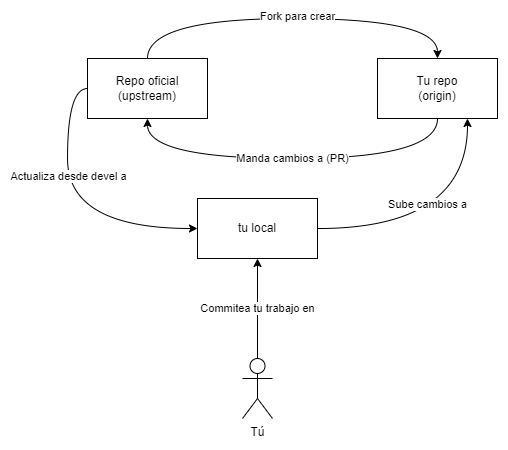

# Flujo de trabajo

El flujo de trabajo sugerido es el más común usado en los proyectos de código abierto
con varios colaboradores, el cual consiste en que cada colaborador tiene un fork del
repositorio principal y los cambios que hagan se hacen en sus propios forks, usando una
rama diferente para cada caracterísitica, procurando siempre que se base en la última
versión del código de la rama ``devel`` en el repositorio principal.

## Diagrama de flujo de trabajo

El flujo completo se vería algo así:

## Paso a paso
1. Haz un fork del repositorio principal en tu cuenta de GitHub.
2. Clona tu fork en tu equipo de trabajo: ``git clone https://github.com/<tu_usuario>/artemanga.git``.
3. Agrega el repositorio principal a tus remotos: ``git remote add upstream https://github.com/corp0/artemanga.git``.
4. Crea una nueva rama a partir de ``devel``: ``git checkout -b <nombre_de_la_rama>``.
5. Hacer cualquier cambio que quieras en tu rama.
6. Hacer un commit y hacer un push a tu rama: ``git commit -am "mensaje" && git push origin <nombre_de_la_rama>``.
7. Hacer un pull request a la rama ``devel`` en el repositorio principal.
8. Para trabajar en otra característica, vuelve a ``devel`` 
y actualiza desde el repositorio principal: ``git checkout devel && git reset upstream/devel --hard``.
9. Repite desde el paso 4.

## Secuencia de una tarea

1. En una reunión se define el alcance del Sprint y las historias de usuario que conforman el backlog.
2. Se definen las tareas que satisfacen las historias de usuario.
3. Se distribuyen las tareas entre los desarrolladores.
4. Se realiza el desarrollo de las tareas.
5. El desarrollador hace un Pull Request a la rama ``devel`` del repositorio principal.
6. Los demás revisan y aprueban o solicitan cambios.
7. Se hace un merge, los demás desarrolladores actualizan sus ramas.
8. Se hace otra tarea y repite desde el paso 4.